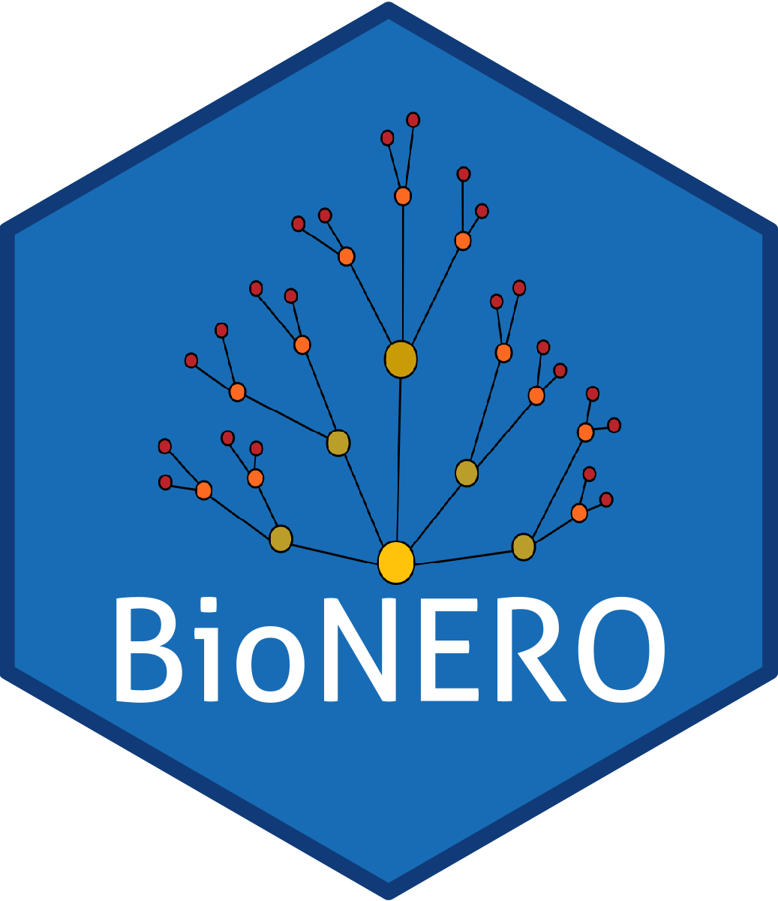

<style>
body {
text-align: justify}
</style>

### About me

I am a computational biologist interested in using and developing algorithms to study the evolution of plant genomes and gene networks. I am particularly interested in investigating how polyploidization events have shaped plant evolution, and how gene duplication can provide new material for genetic innovation in plant taxa.

---
  
### Education

**MSc. Plant Biotechnology** | Universidade Estadual do Norte Fluminense Darcy Ribeiro, *in progress*

**Biologist** | Universidade Estadual do Norte Fluminense Darcy Ribeiro, 2019

---

### Publications

1. **Almeida-Silva, F.**, Venancio, T. M. (2021). BioNERO: an all-in-one R/Bioconductor package for comprehensive and easy biological network reconstruction. *bioRxiv*. https://doi.org/10.1101/2021.04.10.439287

1. **Almeida-Silva, F.**, Venancio, T. M. (2021). Pathogenesis-related protein 1 (PR-1) genes in soybean: genome-wide identification, structural analysis and expression profiling under multiple biotic and abiotic stresses. *bioRxiv*. https://doi.org/10.1101/2021.03.27.437342

1. **Almeida-Silva, F.**, Moharana, K. C., & Venancio, T. M. (2021). The state of the art in soybean transcriptomics resources and gene coexpression networks. *in silico Plants*. https://doi.org/10.1093/insilicoplants/diab005

1. Sangi, S., Araújo, P. M., Coelho, F. S., Gazara, R. K., **Almeida-Silva, F.**, Venancio, T. M., & Grativol, C. (2021). Genome-Wide Analysis of the COBRA-Like Gene Family Supports Gene Expansion through Whole-Genome Duplication in Soybean (*Glycine max*). *Plants*, 10(1), 167. https://doi.org/10.3390/plants10010167

1. **Almeida-Silva, F.**, Moharana, K. C., Machado, F. B., & Venancio, T. M. (2020). Exploring the complexity of soybean (*Glycine max*) transcriptional regulation using global gene co-expression networks. *Planta*, 252(6), 1-12. https://doi.org/10.1007/s00425-020-03499-8

1. Machado, F.B., Moharana, K.C., **Almeida‐Silva, F.**, Gazara, R.K., Pedrosa‐Silva, F., Coelho, F.S., Grativol, C. and Venancio, T.M. (2020), Systematic analysis of 1298 RNA‐Seq samples and construction of a comprehensive soybean (*Glycine max*) expression atlas. Plant J, 103: 1894-1909. https://doi.org/10.1111/tpj.14850

---

### Softwares and data products

1. **BioNERO** 

```{r echo=FALSE, out.width="20%", fig.align='center'}

```

*BioNERO* is an R/Bioconductor package that aims to facilitate network analyses by integrating all standard analysis steps, including data preprocessing, inference of gene regulatory and coexpression network from expression data, functional analyses, and network intra and interspecies network comparisons.

